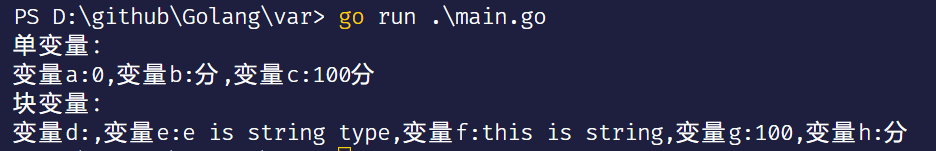

# Golang learning

## 数据类型

## 关键字
| 关键字 | 说明 |  
|:---:| --- |
| break | 终止循环、跳出switch语句 |
| default | 用于switch语句，当没有分支对应时，默认选择的分支 |
| func | 用于声明函数 |
| interface | 用于声明接口 |
| select | |
| case | 与switch搭配使用，用于匹配 |
| defer |  |
| go |  |
| map | 声明map类型 |
| struct | 声明结构体 |
| chan | 通道 |
| else | 与if组成if{}else{}语句 |
| goto |  |
| package | 声明包 |
| switch | 分支选择结构 |
| const | 声明常量 |
| fallthrough |  |
| if | 判断语句 |
| range | 遍历 |
| type | 声明类型 |

## 第三部分 基础语法
### 常量
>常量在定义的时候必须给其赋初始值，且在编译期间就能确定其值，在运行期间其值不能改变。
- 单个常量:  
  const 常量名 数据类型 = 初始值
  cosnt 常量名 = 初始值
  ```go
  const num int64 = 5
  const num = 5 // go编译器根据初始值自动推断num的数据类型
  ```
- 块常量：  
  const (  
    常量1 数据类型 = 初始值  
    常量2 = 10  
    变量3，变量4 = 初始值3，初始值4
  )  
  const 变量1
  ```go
  const (
    num int
    str string = "Hello"
    s = "world!"
    h,w = "Hello ", "World!"
  )
  ```
例子：
```go
// const/main.go
package main

import (
	"fmt"
)

func main() {
	// 单变量
	const a int = 1
	const b = 10

	fmt.Println("单变量：")
	fmt.Printf("变量a:%d,变量b:%d\n", a, b)

	// 块变量
	const (
		c    int64  = 5
		d    string = "Hello"
		e           = "world!"
		f, g        = "Hello ", "World!"
	)

	fmt.Println("块变量:")
	fmt.Printf("变量c:%d,变量d:%s,变量e:%s\n变量f,g:%s,%s\n", c, d, e, f, g)
}
```
运行结果：


### 变量
> 变量是一个在程序运行期间可以改变其值的量

- 单变量：  
  var 变量名 数据类型  
  var 变量名 = 初始值  
  ```go
  // 单变量
	var a int64 // 零值：0
	var b string = "分"
	var c = "100分"变量名 := 初始值  
  ```
  

- 块变量  
  var (  
    变量1 数据类型  
    变量2 数据类型 = 初始值  
    变量3 = 初始值值  
    变量4，变量5 = 初始值4，初始值5  
  )
  ```go
  // 块变量
	var (
		d    string // 零值：""
		e    string = "e is string type"
		f           = "this is string"
		g, h        = 100, "分"
	)  
  ```

例子：  
```go
// var/main.go
package main

import "fmt"

func main() {
	// 单变量
	var a int64 // 零值：0
	var b string = "分"
	var c = "100分"

	// 块变量
	var (
		d    string // 零值：""
		e    string = "e is string type"
		f           = "this is string"
		g, h        = 100, "分"
	)
	fmt.Println("单变量：")
	fmt.Printf("变量a:%d,变量b:%s,变量c:%s\n", a, b, c)
	fmt.Println("块变量：")
	fmt.Printf("变量d:%s,变量e:%s,变量f:%s,变量g:%d,变量h:%s\n", d, e, f, g, h)
}
```
运行结果：  



### 类型

